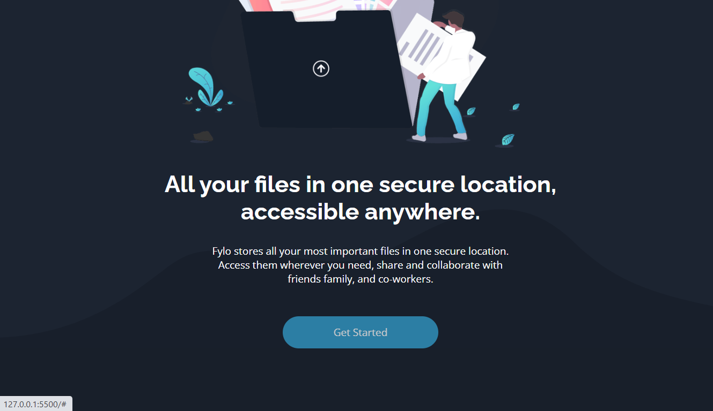

# Frontend Mentor - Fylo dark theme landing page solution

This is a solution to the [Fylo dark theme landing page challenge on Frontend Mentor](https://www.frontendmentor.io/challenges/fylo-dark-theme-landing-page-5ca5f2d21e82137ec91a50fd). Frontend Mentor challenges help you improve your coding skills by building realistic projects. 

## Table of contents

- [Overview](#overview)
  - [The challenge](#the-challenge)
  - [Screenshot](#screenshot)
  - [Links](#links)
- [My process](#my-process)
  - [Built with](#built-with)
  - [What I learned](#what-i-learned)
  - [Continued development](#continued-development)
  - [Useful resources](#useful-resources)
- [Author](#author)
- [Acknowledgments](#acknowledgments)


## Overview

### The challenge

Users should be able to:

- View the optimal layout for the site depending on their device's screen size
- See hover states for all interactive elements on the page

### Screenshot




### Links

- Solution URL: [https://github.com/futuregit/fylo-dark-theme-landing-pag](https://github.com/futuregit/fylo-dark-theme-landing-page)
- Live Site URL: [https://tommyfylo.netlify.app/](https://tommyfylo.netlify.app/)

## My process

With the desktop design files, I wrote the HTML starting with the header going to the bottom. Secondly, the CSS typography and color where added. Then, the media query was added for desktop side. Notice that this mean that the code outside media query is for mobile devices. Therefore, I started styling for mobile first starting again at the header and going to the footer. 

All while this was going on, another browser was open to see the result. The next styling was done for desktop which only consist of adding in css to make the page suitable for larger screens.

Lastly, A few touch was made before finishing the final design.

### Built with

- Semantic HTML5 markup
- CSS 
- Flexbox
- Mobile-first workflow
- Design jpg files

### What I learned

How to shift a element down while keeping the background in place.
1. Wrapped the element you want to shift with a div.
2. Set the position property of that div to relative.
3. Set same position property to relative of the element to be moved.
4. Specify how far from the div you want to move the element down with the top property and you have moved the element while keeping the background stationary. 


```css
.move--email-card-down {
    position: relative;
}

.email-sign-up {
    position: relative;
    top: 12em;
    text-align: center;
    width: 88%;
    margin: 0 auto 0 auto;
    padding: 3em 2em;
    box-shadow: 0 3px 10px rgb(0 0 0 / 0.2);
}

```

### Continued development

Still need to focus on different elements such as input and grid layouts.

### Useful resources

- [Kevin Powell Conquering Responsive Layouts](https://courses.kevinpowell.co/courses/conquering-responsive-layouts) - This helped me to really hit the ground running creating layouts. I really like this because everything else fall in place.

## Author

- Frontend Mentor - [@yfuturegit](https://www.frontendmentor.io/profile/futuregit)


## Acknowledgments

Got inspiration from course on Udemy.com and blogs.

